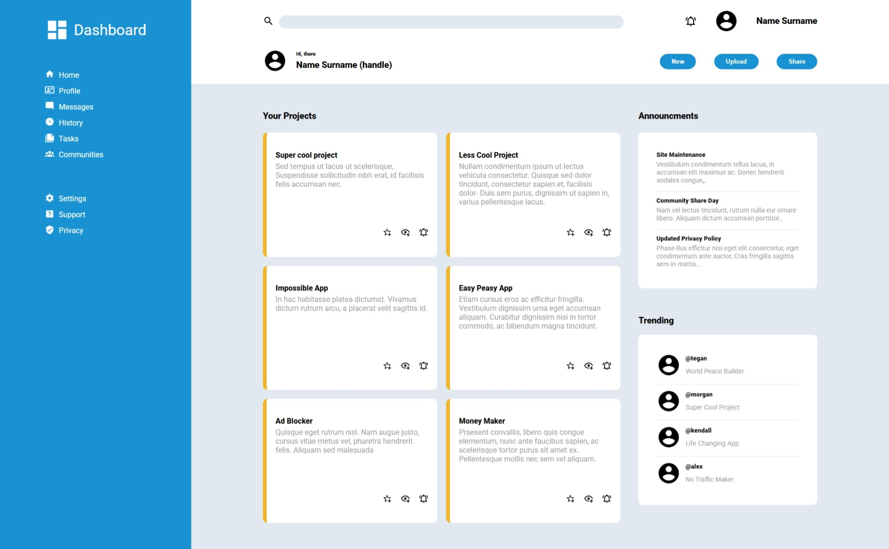

# 🧭 Admin Dashboard

A sleek, responsive admin dashboard built using **HTML**, **CSS Grid**, and modern design principles. This project is part of [The Odin Project's Intermediate HTML and CSS curriculum](https://www.theodinproject.com/lessons/node-path-intermediate-html-and-css-admin-dashboard), focusing on mastering layout techniques with CSS Grid.

## 🚀 Live Demo

Check out the live version [here](https://wolfskullcave.github.io/Admin-Dashboard/).

## 📦 Features

- 🧱 **Grid-based layout**: Sidebar, header, and main content areas structured with CSS Grid
- 🔍 **Search bar** and user profile section in the header
- 📁 **Project cards**, announcements, and trending sections in the main content
- 🎨 Custom fonts and icons via Google Fonts and Material Design Icons

## 🛠️ Technologies Used

- HTML5
- CSS3 (Grid, Flexbox, custom styling)
- Google Fonts (Roboto)
- Material Design Icons (SVG)

## 📐 Layout Overview

The dashboard is divided into three main sections:

| Section        | Description                                                                 |
|----------------|-----------------------------------------------------------------------------|
| Sidebar        | Navigation links and branding, styled with nested grids                     |
| Header         | Search input, user info, and action buttons                                 |
| Main Content   | Grid layout for projects, announcements, and trending items                 |

## 🎯 Goals

- Practice advanced CSS Grid techniques
- Build a clean, functional layout from a design mockup
- Improve visual hierarchy and spacing using modern CSS

## 📸 Screenshots

## ⚠️ Known Issues

- Layout is not repsonsive
- Page contains no links
- Page contains placeholder content

## 🙌 Acknowledgements

- [The Odin Project](https://www.theodinproject.com/lessons/node-path-intermediate-html-and-css-admin-dashboard) for the project inspiration and curriculum
- [Material Design Icons](https://materialdesignicons.com/) for SVG assets
- [Google Fonts](https://fonts.google.com/) for typography
